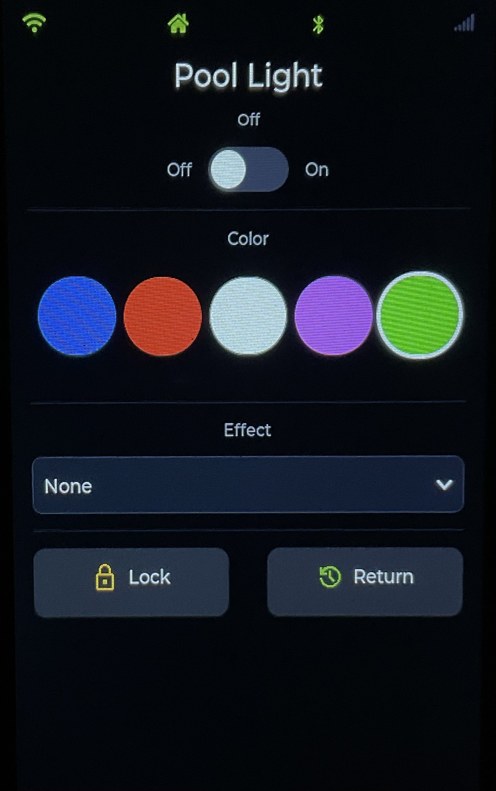

# colorsplash-xg-ha

Home Assistant control for the **Hayward / J&J Electronics
ColorSplash XG** pool light controller (LPL-XG-CTRL-1) via a
small ESP32 BLE bridge. Two variants ship: a primary **headless
bridge** that puts the user-facing UI in Home Assistant, and a
**display variant** with a 7" LVGL touchscreen on the wall
(preserved at tag `v0.1.0-display`).

## Purpose

The ColorSplash XG controller only ships with iOS and Android
phone apps to control it over Bluetooth — and Bluetooth only;
there's no Wi-Fi, Zigbee, Z-Wave, or local wired interface. That
makes it a black box from Home Assistant's point of view, and it
forces the homeowner to keep unlocking a phone and walking into
range every time they want to change the pool color.

This project builds a permanently-online bridge:

- A small **ESP32 dev board** placed within BLE range of the
  equipment pad holds a continuous BLE GATT connection to the
  controller 24/7, replacing the phone app entirely. It
  auto-reconnects on any dropout.
- The ESP32 **exposes the controller to Home Assistant** as a
  Light entity (plus diagnostic entities) using ESPHome's native
  API over the LAN — no cloud, no custom Python integration, no
  MQTT required.
- A **stock-Lovelace HA card** (in
  [`dashboard/colorsplash-xg.yaml`](dashboard/colorsplash-xg.yaml))
  drives the light from any device that can reach Home Assistant.
- For owners who want a wall-mounted local touchscreen instead,
  the historical [display variant](#display-variant) runs the
  bridge on a Waveshare 7" ESP32-S3 touch panel with a full LVGL
  UI. It's preserved at tag `v0.1.0-display` and is still
  functional, but is no longer the primary path.

<p align="center">
  
  <br>
  <sub>The display variant on the wall — the headless variant has no UI of its own and is just a small ESP32 next to the equipment pad.</sub>
</p>

Status: **Phases 1–3 complete and shipping.** Both variants run
the same BLE protocol and expose the same HA entities. The pivot
to the headless variant is in progress; the display variant
remains usable but is no longer the focus.

## Caveat Emptor

This is a resource for those who may already own this light controller. I wish I had understood its limitations better before buying it, and I would absolutely not recommend it to anyone else. The built-in solid colors are unimaginative primary colors, there's no direct control over the RGB hue or brightness, and it's extremely expensive for what it offers. If you are used to LED bulbs with precise color control, you will be sorely disappointed.

That said, if you already have this hardware, and are looking to make the best of it, read on…

## What works today

### Bridge core (both variants)

- **Continuous BLE link** to the LPL-XG-CTRL-1 with
  auto-reconnect, exponential backoff, and BLE-stack reset after
  persistent failure (Phase 2 #12). 72-hour soak test recorded
  **100% uptime, zero watchdog reboots**
  ([`docs/SOAK_TEST.md`](docs/SOAK_TEST.md)).
- **Home Assistant `light.pool_light`** entity exposing on/off
  (Standby) and the 12 named effects (5 solids + 7 shows). Plus
  diagnostic entities: RSSI, connected, last command, command
  counter, error counter (Phase 2 #11, #13).
- **Stock-Lovelace card** for the HA dashboard side
  ([`dashboard/colorsplash-xg.yaml`](dashboard/colorsplash-xg.yaml),
  Phase 2 #39).
- **Reverse-engineered protocol** documented in
  [`docs/PROTOCOL.md`](docs/PROTOCOL.md), with a `bleak`-based
  Python reference client in `tools/cli.py`.

### Headless variant (primary, current)

- ESPHome config: [`firmware/esphome/colorsplash-xg-headless.yaml`](firmware/esphome/colorsplash-xg-headless.yaml).
- Targets a plain ESP32-WROOM-32 dev kit placed near the equipment
  pad for best BLE link margin.
- No display, no LVGL — Home Assistant is the user-facing UI via
  the dashboard card above.
- **Optional experimental RGB picker (Phase 4b).** When
  `rgb_mode: true` is set on the `light:` config, HA's standard
  light card gains a color wheel that drives the bridge's
  embedded show-scrub picker. Default off because the reachable
  color gamut is constrained (some target RGBs land
  approximately, not exactly). To toggle, edit the headless YAML's
  `light:` block:
  ```yaml
  light:
    - platform: colorsplash_xg
      # ...
      rgb_mode: true   # experimental color wheel
      # rgb_mode: false  # classic on/off + named effects only (default)
  ```
  Re-flash the bridge, then reload the ESPHome integration in HA
  so it picks up the new color-mode advertisement. See
  [issue #54](https://github.com/swizzlevixen/colorsplash-xg-ha/issues/54)
  for the full design + the future preset-card path
  ([#53](https://github.com/swizzlevixen/colorsplash-xg-ha/issues/53)).

### Display variant

- ESPHome config: [`firmware/esphome/colorsplash-xg-display.yaml`](firmware/esphome/colorsplash-xg-display.yaml).
  Frozen snapshot at tag
  [`v0.1.0-display`](https://github.com/swizzlevixen/colorsplash-xg-ha/releases/tag/v0.1.0-display).
- Targets the Waveshare ESP32-S3-Touch-LCD-7 (7" 800×480 RGB
  panel + GT911 touch + ESP32-S3-WROOM-1).
- **Tear-free 7" RGB display** at 800×480 with concurrent BLE +
  Wi-Fi, achieved via vendor-aligned PSRAM tuning + a patched
  local `mipi_rgb` component
  ([`docs/WAVESHARE_LCD_TUNING.md`](docs/WAVESHARE_LCD_TUNING.md)).
- **LVGL touchscreen UI** (Phase 3 #15, #17, #50):
  - Status bar with Wi-Fi / HA-API / BLE indicators + 5-bar RSSI
    meter.
  - Single-tap on/off switch.
  - Five circular color swatches that drive the matching solid
    preset; the active swatch shows a white outline.
  - Effect dropdown for the seven shows; dropdown→None replays
    the last solid color the user displayed (or the locked
    color, if Lock was the last action).
  - Lock + Return buttons that map to the controller's show-scrub
    primitives.
- **Standalone-capable** — every on-screen action drives the BLE
  link directly, so the panel keeps working when Home Assistant is
  unreachable
  ([`docs/STANDALONE_TEST.md`](docs/STANDALONE_TEST.md)).

## What we had to work around

A reasonable amount of this project's budget went to engineering
around quirks of the pool controller. Notes for
the next person:

- **BLE-only, no documented protocol.** The controller has no Wi-Fi,
  Z-Wave, Zigbee, or wired interface. There is no public protocol
  doc. Phase 1 was an end-to-end reverse-engineering effort: Android
  HCI snoop captures, APK decompile, nRF52840 sniffing, manual
  decode → [`docs/PROTOCOL.md`](docs/PROTOCOL.md).
- **One BLE master at a time.** Whenever the ESP32 holds the GATT
  link, the official phone app cannot connect. This is fundamental
  to BLE; the workaround is to just use the touchscreen or HA
  instead of the app.
- **No readable state.** The controller will not tell you what
  color or show it is currently displaying — only what command was
  most recently sent. We cache the last preset byte locally and
  treat it as the source of truth.
- **No native "stop the effect" command.** To leave an effect and
  return to a solid, you re-send a solid-color byte. The bridge
  synthesises this by remembering the last solid the user picked
  and replaying it when the dropdown returns to "None" (issue #45).
- **Fixed palette in fixture firmware.** Five solids + seven shows
  is what the fixture supports. Arbitrary RGB requires the Phase 4b
  show-scrub workaround (lock the fixture mid-show on the color
  you want).
- **BLE range is marginal through interior walls.** At the
  display variant's wall-mount location the RSSI floated between
  −88 and −95 dBm — at the edge of stable reconnect. This drove
  the pivot to the headless variant, which puts the ESP32 next to
  the equipment pad. First measurement after the swap: **−67 dBm
  steady** — about 25 dB better, or roughly 300× stronger
  signal.

## Architecture

```
                                   ┌── Headless variant (primary) ──┐
                                   │  Small ESP32 near the pad       │
[J&J LPL-XG-CTRL-1] ──BLE GATT────►│  (esp32dev / WROOM-32)          │──ESPHome native API──► [Home Assistant ──► Lovelace card / app]
                                   └────────────────────────────────┘
                                   ┌── Display variant ─────────────┐
                                   │  Waveshare ESP32-S3-Touch-LCD-7 │──ESPHome native API──► [Home Assistant]
                                   │  + LVGL UI on the wall          │
                                   │  (standalone-capable)           │
                                   └────────────────────────────────┘
```

## Established facts

| Item | Value |
|------|-------|
| Controller | J&J Electronics LPL-XG-CTRL-1 (Bluetooth) |
| Controller power | 120 VAC, 60 Hz, 400 W max load |
| Fixture | XG pool/spa RGB (preset palette in fixture firmware) |
| Bridge hardware (headless) | ESP32-WROOM-32 dev kit (`esp32dev`), placed near the equipment pad |
| Bridge hardware (display) | Waveshare ESP32-S3-Touch-LCD-7 (7" 800×480 RGB parallel, GT911 cap touch, PSRAM, BLE 5) |
| HA location | Same LAN as the ESP32 |
| BLE exclusivity | ESP32 owns the link 24/7; phone app cannot connect while ESP32 is connected |
| Capture tools | Android HCI snoop, iOS via macOS PacketLogger, nRF52840 USB dongle (on hand) |

## Confirmed app UI surface

The official ColorSplash XG app layout (verified from screenshots):

- Header: app title "XG Controller" + **Standby** toggle (top-right)
- Two status cards: **Status** (tap to open the device-select sheet) +
  **Network** (Bluetooth)
- 4×3 grid of 12 effect tiles
- Persistent bottom bar: **Lock** | **Disconnect** | **Return**

Controls:

- **Connect** (via tapping the Status card → "Select device" sheet →
  "Connect to XG controller"). No password/confirmation.
- **Disconnect** (bottom bar)
- **Standby toggle** (header) — blanks the light; resuming restores the
  previous color/show (controller maintains state)
- **Lock** (bottom bar) — freezes the current color during a show; this
  is the freeze primitive for Phase 4b
- **Return** (bottom bar) — semantics unclear, to be determined by the
  Phase 1 sweep
- 5 solid colors: **Parisian Blue**, **Brazilian Red**, **Arctic White**,
  **Miami Pink**, **New Zealand Green**
- 7 shows: **Nova**, **Super Nova**, **Northern Lights**, **Tidal Wave**,
  **Patriot Dream**, **Desert Skies**, **Peruvian Paradise**

No brightness slider, no show-speed slider, no scheduling, no settings
screen, no long-press behaviors. The HA light entity will therefore
expose `on/off` (mapped to Standby) + `effect` (the 12 named effects)
only — no `brightness`.

## Named risks

1. **Arbitrary RGB is unlikely.** The XG RGB fixture palette lives in
   the fixture's firmware, not the controller. The controller almost
   certainly drives the fixture with timed AC interruption sequences
   that each select a preset color or show. Treated as a time-boxed
   experiment, not a goal.
2. **BLE range.** Waveshare's on-PCB antenna vs. pool controller through
   walls. If RSSI at the chosen wall spot is worse than about −85 dBm we
   will add a second ESP32 as a BLE proxy closer to the pad.
3. **Phone app stops working** whenever the ESP32 is connected.
   Accepted.
4. **S3 resource contention.** RGB parallel display + LVGL + BLE + Wi-Fi
   is a lot on one chip. Pin BLE to one core, keep LVGL framebuffers in
   PSRAM, keep the UI redraw modest.
5. **Pairing / encryption.** If the controller uses LE Secure
   Connections we must capture the pairing handshake. The nRF52840
   sniffer is how we do that; it is on hand.
6. **Legal.** Reverse engineering for interoperability is permitted
   under DMCA §1201. We will not redistribute decompiled APK code.

## Plan

### Phase 0 — Scaffolding (1 issue) ✅

- Repo layout (`docs/`, `firmware/esphome/`, `tools/`, `captures/`,
  `protocol/`)
- `.gitignore` for Python, ESPHome build dirs, captures (pcap, btsnoop)
- Issue / PR templates
- The plan document

### Phase 1 — Reverse engineering (7 issues) ✅

1. Document Android HCI snoop capture procedure (Developer Options →
   Enable Bluetooth HCI snoop log → reproduce → pull
   `btsnoop_hci.log`).
2. Pull and decompile the Android APK with jadx; identify the BLE
   service class, service / characteristic UUIDs, packet builders, any
   framing constants. No decompiled code checked in.
3. Set up nRF52840 USB dongle in Wireshark via Nordic's nRF Sniffer for
   Bluetooth LE plugin; confirm captures show the controller's
   advertisements and GATT traffic.
4. Structured capture sweep: a scripted procedure that exercises every
   app action with timestamps so each packet can be correlated back to a
   UI action.
5. iOS cross-check: use macOS PacketLogger to capture the same sweep
   from the iOS app, confirm both apps speak the same protocol, record
   any version-gated differences.
6. Decode the protocol into `docs/PROTOCOL.md`: service / characteristic
   UUIDs, packet framing, opcodes, parameters, any handshake or auth,
   any checksum, known unknowns.
7. Python `bleak` reference client in `tools/cli.py` that replays every
   command end-to-end against the real controller; ship-quality CLI so
   later phases can regression-test the protocol.

### Phase 2 — ESPHome bridge, headless (5 issues) ✅

1. Waveshare ESP32-S3-Touch-LCD-7 base ESPHome config: board,
   PSRAM enable, Wi-Fi, OTA, native API, logger, captive portal
   fallback. No BLE or display yet — just a boot-and-connect baseline.
2. `ble_client` configuration +
   `firmware/esphome/components/colorsplash_xg/` custom component that
   wraps the protocol discovered in Phase 1 (commands, notifications,
   framing).
3. `light` entity on top of the custom component, with `effects:`
   listing the 7 shows + 5 colors as discrete named effects, plus on /
   off mapped to Standby.
4. Auto-reconnect strategy: `auto_connect: true`, exponential backoff
   watchdog (retry at 1 s, 2 s, 5 s, 15 s, then every 30 s), BLE-stack
   reset after N consecutive failures, HA-visible `connected` binary
   sensor.
5. Diagnostics: RSSI sensor, connected binary sensor, last-command text
   sensor, command counter, error counter. Then a 72-hour soak test
   leaving the device connected; log every disconnect and the time to
   reconnect.

### Phase 3 — LVGL touchscreen UI (4 issues) ✅

1. ESPHome display + touch driver for the Waveshare 7": RGB parallel
   panel pins, GT911 I²C touch, LVGL buffer sizing in PSRAM.
2. Main screen: power toggle, current-effect label, 12-button grid (7
   shows + 5 colors) with clear visual feedback of the active effect.
3. Brightness / speed sliders — implemented only if Phase 1 confirms the
   controller exposes them; otherwise the UI omits the slider rather
   than showing a dead control.
4. Status bar (Wi-Fi, HA API, BLE, RSSI) plus a standalone-mode
   verification pass: disconnect HA, confirm every UI action still
   drives the light.

### Phase 4 — RGB experiment (3 issues, time-boxed)

**4a — Direct arbitrary RGB probe (~1 day).** After the protocol is
understood, spend one focused session probing undocumented opcodes,
out-of-range parameters, raw 3-byte writes, and any channel-style
commands. Write up the result in `docs/RGB_EXPERIMENT.md`.

**4b — Show-scrub fallback (~1 day), if 4a is negative.** Mirror the
manual technique pool owners use today — and which the official app
exposes explicitly via a **Lock** button that freezes the fixture on
whatever color it's currently displaying mid-show:

1. **Characterize every show** via video — build a `(show_id, t_ms) →
   (R, G, B)` table.
2. **The Lock opcode is the freeze primitive** — captured for free
   during the Phase 1 sweep.
3. **Build the picker.** Expose `set_color(r, g, b)` that maps to
   `(show, offset, freeze)`, sends the "start show" command, waits
   `offset_ms`, then sends Lock.
4. **UX.** If 4b works: add an HSV/color-wheel to the LVGL UI and an
   `hs_color` mode on the HA light entity.

**4c — Photodiode sync (deferred contingency).** If the controller
doesn't emit state-change notifications and wall-clock timing proves
inadequate, an external photodiode observing the fixture's
blackout-on-state-change provides a deterministic sync signal.

### Phase 5 — Reliability & polish (3 issues)

1. End-to-end OTA flow verified, including that the BLE link recovers
   cleanly after OTA reboots.
2. Example HA automations / blueprint (sunset-on, sunrise-off, scene
   glue).
3. `docs/HARDWARE.md` with wiring photos, enclosure notes, install
   steps, troubleshooting tree.

### Phase 6 — Release (1 issue)

- Tag `v0.1.0`, finalize the README, post to the HA community forum to
  solicit cross-confirmation from other XG owners on different
  controller firmware versions.

## Deliverables

- [`docs/PLAN.md`](docs/PLAN.md) — canonical approved plan
- `docs/PROTOCOL.md` — discovered BLE protocol
- `docs/HARDWARE.md` — wiring, photos, install
- `docs/RGB_EXPERIMENT.md` — what we tried and what worked
- `firmware/esphome/colorsplash-xg-headless.yaml` — primary, headless ESP32 bridge
- `firmware/esphome/colorsplash-xg-display.yaml` — display variant (tag `v0.1.0-display`)
- `firmware/esphome/components/colorsplash_xg/` — custom component (shared)
- `tools/cli.py` — bleak-based reference client
- `captures/` — gitignored, except a README explaining how to reproduce

## What this project will not do

- Ship a custom Home Assistant Python integration. ESPHome's native API
  already is the HA integration; writing a second one would only
  duplicate ESPHome's entity plumbing.
- Redistribute decompiled APK source.
- Buy or recommend more hardware unless the Phase 2 field test proves
  the current BLE range is inadequate.

## Repository layout

```
assets/        # README image(s)
dashboard/     # HA Lovelace card YAML
docs/          # PLAN.md, PROTOCOL.md, SOAK_TEST.md, STANDALONE_TEST.md, WAVESHARE_LCD_TUNING.md, …
firmware/
  esphome/     # colorsplash-xg-headless.yaml + colorsplash-xg-display.yaml + components/
tools/         # bleak-based CLI and protocol utilities
captures/      # gitignored; README-only stub tracks the procedure
protocol/      # machine-readable protocol artifacts (JSON/YAML)
```

## License

See [`LICENSE`](LICENSE) (MIT).
