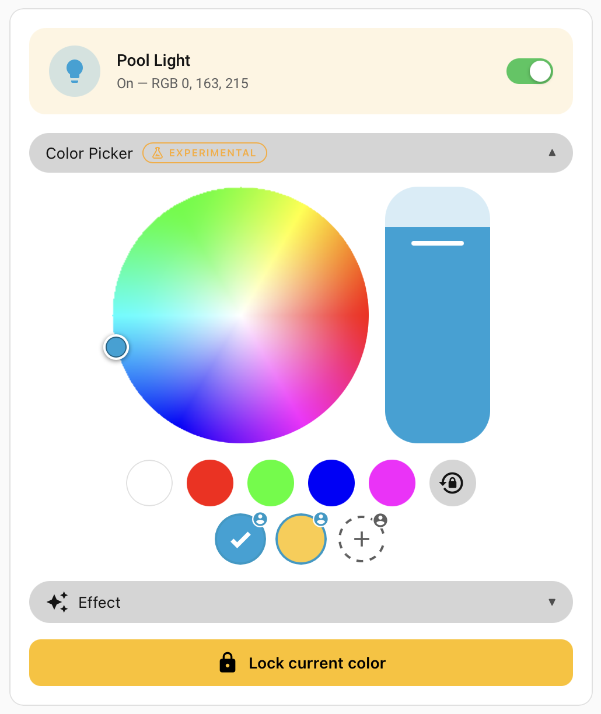
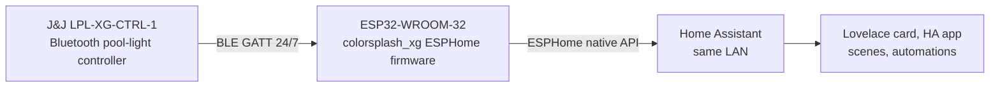

# colorsplash-xg-ha

Home Assistant control for the **Hayward® / J&J Electronics™ ColorSplash® XG** pool light controller (LPL-XG-CTRL-1) via a small ESP32 BLE bridge. Replaces the official phone app with a permanent LAN-side bridge so the light shows up in Home Assistant as a normal entity you can drive from any dashboard, automation, or scene.

<p align="center">
  
</p>

_Hayward®, J&J Electronics™, and ColorSplash® are trademarks of Hayward Industries, Inc.. This project is not affiliated with Hayward in any way, and the entire purpose of this software is to provide interoperation with [Home Assistant](https://www.home-assistant.io/), a project from the [Open Home Foundation](https://www.openhomefoundation.org/)._

Looking for the wall-mounted touchscreen variant? See [§Wall-mounted touchscreen variant](#wall-mounted-touchscreen-variant) at the bottom.

## Caveat emptor

The ColorSplash XG hardware only supports a fixed palette of 5 solid colors and 7 animated shows, has no brightness control, and has no native way to display arbitrary RGB. If you're shopping for a smart pool light, there are friendlier options. **If you already own this controller, this project attempts to make the best of it.**

## Quick start

The user-facing path is short. Each step links to the doc with the details.

1. **Get the hardware.** A plain **ESP32-WROOM-32** dev board is all you need. Any HA-supported ESPHome board works in principle, but the BOM and install notes assume a WROOM-32 dev kit. See [`docs/HARDWARE.md`](docs/HARDWARE.md).

2. **Flash the firmware.** Edit `firmware/esphome/secrets.yaml` with your Wi-Fi credentials and OTA password, then run `esphome run firmware/esphome/colorsplash-xg-headless.yaml` from a USB-connected Mac/Linux box. See [`firmware/esphome/README.md`](firmware/esphome/README.md).

3. **Place it near the pool equipment pad.** BLE range is the single biggest deployment variable; the closer to the ColorSplash XG controller, the better. See [install location](docs/HARDWARE.md#install-location) in `docs/HARDWARE.md`.

4. **Add the device in Home Assistant.** HA's ESPHome integration auto-discovers the bridge on the LAN. Approve it; you'll see a new device with a `light.pool_light` entity, a `select.pool_active_preset`, two `button.*` entities for Lock/Return, and a handful of diagnostic sensors.

5. **(Recommended) Add the Lovelace card.** Drop the JS card into your dashboard for the polished UX — color wheel, swatches, saved presets. The stock-Lovelace YAML version works too if you prefer no custom resources. See [`dashboard/README.md`](dashboard/README.md).

That's it. The bridge holds a 24/7 BLE link to the controller, auto-reconnects on dropouts, and surfaces every fixture state to HA.

## What you get in Home Assistant

| Entity | What it does |
|---|---|
| `light.pool_light` | On/off + 12 effects (5 solids + 7 shows). The "On"-without-effect state replays the last solid you picked. |
| `select.pool_active_preset` | Currently-active user-saved preset, by slug. Drop into a scene to recall it natively. |
| `button.pool_color_lock` | Sends the controller's Lock byte — captures the current displayed color into the controller's "last locked" slot. |
| `button.pool_color_return` | Sends Return — replays the previously-locked color. |
| `sensor.pool_color_preset_count` and `pool_color_preset_0..4` | The 5 user preset slots (diagnostic, JSON-encoded). |
| `sensor.pool_last_displayed_color` | Estimated `#rrggbb` of the fixture's currently-displayed color. |
| `sensor.pool_last_picked_recipe`, `pool_last_command`, `pool_ble_rssi`, `pool_command_count`, `pool_error_count`, `pool_last_ble_error`, `pool_last_echo` | Diagnostics + telemetry. |
| `binary_sensor.pool_ble_connected` | True while the bridge holds a live GATT link. |

For a complete reference, see [HA-facing entity surface](firmware/esphome/README.md#ha-facing-entity-surface) in `firmware/esphome/README.md`.

## Using the Lovelace card

The custom JS card in [`dashboard/colorsplash-xg-card.js`](dashboard/colorsplash-xg-card.js) gives you:

- An on/off tile
- An experimental color-wheel picker (collapsible, defaults closed)
- The 5 hardware solids + Return as a row of swatches; the active swatch is marked with a checkmark
- Saved user presets (up to 5) as a second row of swatches, each with a user badge. Tap to recall, long-press to edit, plus a `+` button to create a new one from the picker's current color
- An effect dropdown for the 7 animated shows

Install steps + customization options live in [`dashboard/README.md`](dashboard/README.md).

## How it differs from the native iOS/Android app

The native app exposes 12 effect tiles, a Standby toggle, and Lock / Return / Disconnect controls — and that's it. This project makes a few deliberate UX choices that diverge from that surface:

- **24/7 connection.** The bridge holds the BLE link continuously, so changing a color is just a tap in HA. No phone unlock, no walk-into-range, no manual reconnect after the controller resets
- **An (experimental) color picker.** The fixture has no arbitrary-RGB capability, but a [show-scrub technique](docs/RGB_EXPERIMENT.md) lets the bridge approximate a given target RGB by starting the matching show and freezing it on the right frame. The picker lives in the JS card with that "approximate" framing built in. The light entity itself stays honest as on/off + 12 effects
- **User-saved presets.** Save a color you like as a named preset; recall it from a scene, an automation, or the card. The native app has no equivalent. This is saved as a "show + lock time" recipe
- **Scene integration.** A scene that includes `select.pool_active_preset: { option: <slug> }` reproduces the stored color recipe on activation
- **Standby = HA "off".** The native app's Standby toggle is the off-switch; the project mirrors that

## Known constraints

A few user-facing facts worth knowing up-front. The longer methodology / engineering history lives in `docs/PLAN.md` and `docs/RGB_EXPERIMENT.md`; this list is just what you'll bump into in normal use.

- **The phone app can't connect while the bridge is online.** BLE is one-master; the bridge owns the link. Use HA instead, or briefly stop the bridge if you really need the app
- **No readable state from the controller.** The fixture won't tell anyone what color it's currently showing — only what command was most recently sent. The bridge tracks intent locally; if someone pulls the breaker mid-show, the bridge may briefly lie about what the hardware shows
- **BLE range matters.** Place the ESP32 within line-of-sight or wall-or-two of the equipment pad. RSSI better than ~−85 dBm is the practical floor for stable reconnect; the maintainer's install runs at −67 dBm
- **No native arbitrary RGB.** The fixture's reachable color gamut is constrained — saturated primaries are exact, mid-tones are approximate. The picker's "best match" is honest about this
- **Five user preset slots.** Hard cap, deterministic — saving a 6th refuses cleanly rather than silently dropping data. Why five? See issue [#65](https://github.com/Vixen-Labs/colorsplash-xg-ha/issues/65)

## Architecture



## Documentation

- [`docs/HARDWARE.md`](docs/HARDWARE.md) — BOM, wiring, install location, troubleshooting
- [`firmware/esphome/README.md`](firmware/esphome/README.md) — flashing, OTA updates, the full HA-facing entity surface
- [`dashboard/README.md`](dashboard/README.md) — Lovelace card install, customization, scene-binding via `select.pool_active_preset`
- [`docs/PROTOCOL.md`](docs/PROTOCOL.md) — reverse-engineered BLE protocol (framing, opcodes, effect table, capture sweeps)
- [`docs/RGB_EXPERIMENT.md`](docs/RGB_EXPERIMENT.md) — what we tried for arbitrary RGB and how the show-scrub picker landed
- [`docs/SOAK_TEST.md`](docs/SOAK_TEST.md) — 72 h soak procedure and results
- [`docs/PLAN.md`](docs/PLAN.md) — original project plan, phase history, deliverables, and "what this project will not do"
- [`docs/CAPTURING.md`](docs/CAPTURING.md) — BLE capture procedures
- [`docs/OTA_TEST.md`](docs/OTA_TEST.md) — OTA recovery validation

## Repository layout

```
assets/        # README image(s)
dashboard/     # HA Lovelace card (JS + stock-YAML versions)
docs/          # Protocol, hardware, plan, experiment notes
firmware/
  esphome/     # ESPHome configs + the colorsplash_xg custom component
tools/         # bleak-based reference CLI + protocol utilities
captures/      # gitignored; README-only stub tracks the procedure
```

## Wall-mounted touchscreen variant

<p align="center">
  
</p>

An earlier variant of this project ran on a Waveshare ESP32-S3 7" touchscreen with a full LVGL UI — a wall-mounted standalone controller that didn't depend on Home Assistant being reachable. It's preserved at tag [`v0.1.0-display`](https://github.com/Vixen-Labs/colorsplash-xg-ha/releases/tag/v0.1.0-display) and the YAML config is still in [`firmware/esphome/colorsplash-xg-display.yaml`](firmware/esphome/colorsplash-xg-display.yaml), but it isn't kept up to date with the headless variant's features and isn't the recommended path. If you want the wall panel UX, that tag is the canonical "phase 3 complete" snapshot; flash, install, and use as-is. Tuning notes live in [`docs/WAVESHARE_LCD_TUNING.md`](docs/WAVESHARE_LCD_TUNING.md).

The pivot from display to headless was driven by BLE range: the wall location's RSSI floated between −88 and −95 dBm, at the edge of stable reconnect, while a small ESP32 next to the equipment pad runs at −67 dBm steady. The full reasoning lives in [`docs/PLAN.md`](docs/PLAN.md).

## License

See [`LICENSE`](LICENSE) (MIT).
